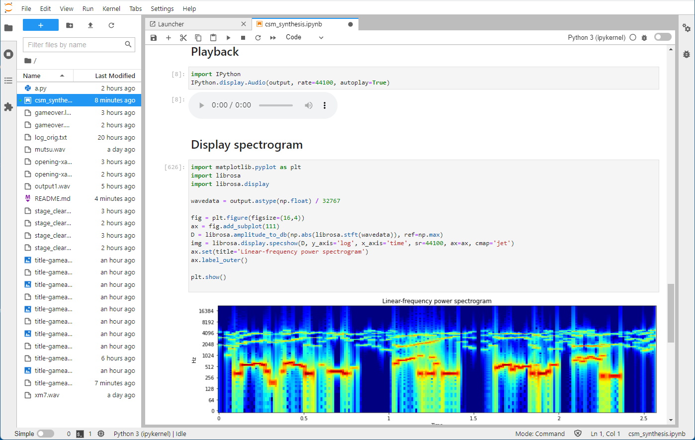

# Composite Sinusoidal Modeling (CSM) Voice Synthesis by Python  

**Disclaimer**: I'm not an expert on FM sound devices.  
**Caveat**: This is just an experimental code.  

## Description:  
Yamaha YM2203C (OPN) equivalent CSM voice synthesis test code.  




## Input data  

This program assumes the input data in the format below:  

```
YM2203C Reg[$26]=$FB at 21434154442
YM2203C Reg[$27]=$BA at 21434218321
YM2203C Reg[$B2]=$07 at 21434281644
YM2203C Reg[$32]=$01 at 21434348855
YM2203C Reg[$3A]=$01 at 21434412734
```
The last decimal numbers are timestamp [ns].  

You need to prepare the input data like above somehow.  
One of the way is to use the ['Mutsu'](https://github.com/captainys/77AVEMU), a Fujitsu FM-7 series personal computer emulator from captainYS.  
The Mutsu can dump FM sound device register access information with following command.  
```
mon fmwrite
```
You can trim the log data down to pick up only the part for CSM voice synthesis.  
You can identify the required part by checking the register $27 (Ch3 mode). When the Reg27[7:6] are set to '10', the FM sound device is set to CSM voice synthesis mode.  
You might need the prescaler setting change part right before the Ch3 mode change. Otherwise, the frequency of the result sound data might be different from expected.  

**Note**: Most YM2203 datasheet tells Reg27[7:6]='01' for CSM voice synthesis mode, but it should be an error.  
**Note**: I can't share the input data due to copyright.  

```
YM2203C Reg[$A6]=$00 at 21433762838
YM2203C Reg[$A2]=$00 at 21433831160
------------------------------------------- You might need from here
YM2203C Reg[$2F]=$00 at 21433900593  <= Prescaler change to 1/2 (from 1/3)
Pre-Scaler [2F]=00
YM2203C Reg[$25]=$00 at 21433964472
YM2203C Reg[$24]=$00 at 21434027240
YM2203C Reg[$28]=$02 at 21434090563
YM2203C Reg[$26]=$FB at 21434154442
YM2203C Reg[$27]=$BA at 21434218321  <= Reg27[7:6]=='10'
YM2203C Reg[$B2]=$07 at 21434281644
YM2203C Reg[$32]=$01 at 21434348855

  :
  :
  :
YM2203C Reg[$27]=$AB at 23888862699
YM2203C Reg[$28]=$02 at 23888965459
YM2203C Reg[$2D]=$02 at 23889028227
Pre-Scaler [2D]=02
YM2203C Reg[$2E]=$02 at 23889090995
Pre-Scaler [2E]=02
YM2203C Reg[$42]=$7F at 23889154318
YM2203C Reg[$4A]=$7F at 23889217641
YM2203C Reg[$46]=$7F at 23889280964
YM2203C Reg[$4E]=$7F at 23889344287
YM2203C Reg[$92]=$00 at 23889409276
YM2203C Reg[$9A]=$00 at 23889473155
YM2203C Reg[$96]=$00 at 23889537034
YM2203C Reg[$9E]=$00 at 23889598691
------------------------------------------- to here
YM2203C Reg[$27]=$30 at 23889684233  <= Reg27[7:6]=='00'
YM2203C Reg[$28]=$02 at 23889747556
YM2203C Reg[$2D]=$02 at 23889810324
```

### Memo:  
Convert audio data into mono/32Kbps wav format data.

```sh
ffmpeg\bin\ffmpeg.exe -i input.wav -ar 32000 -ac 1 -f wav "output.wav"
```
